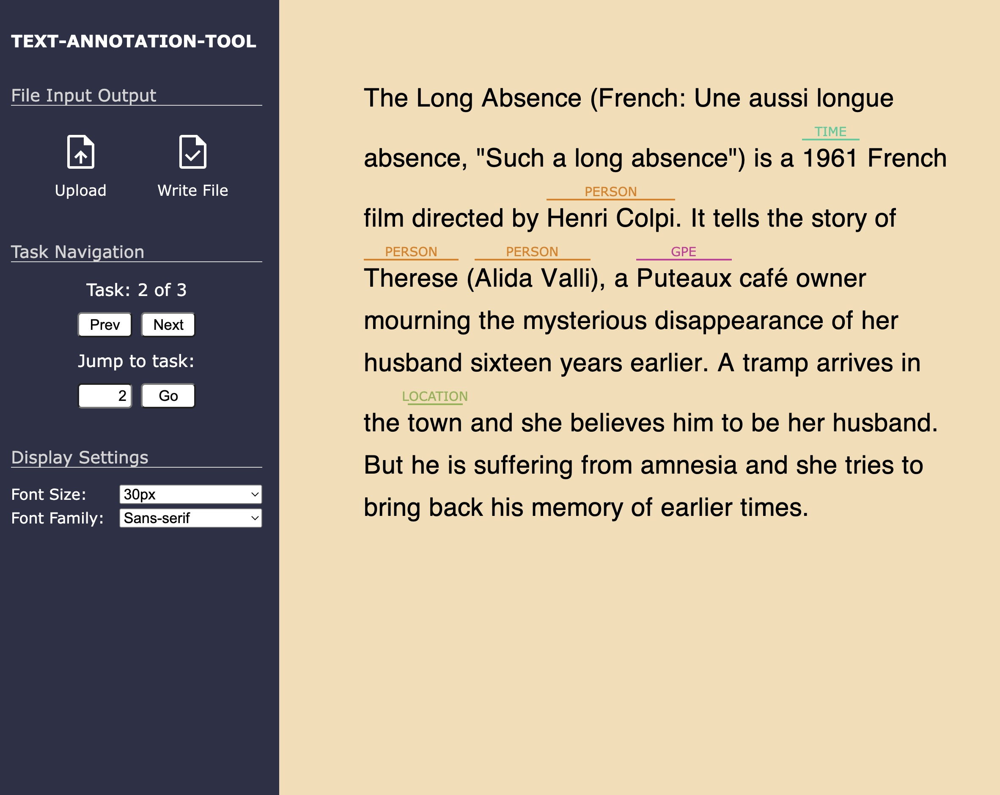

<div id="top"></div>


<!-- PROJECT LOGO -->
<br />
<div align="center">
  <!-- <a href="https://github.com/github_username/repo_name">
    
  </a> -->

<h3 align="center">Text-Annotation-Tool</h3>

  <p align="center">
    A browser-based tool for annotating texts for NLP/ML tasks. 
    <br />
    <a href="https://github.com/qluan1/text-annotation-tool">Try App</a>
    ·
    <a href="https://github.com/qluan1/text-annotation-tool/issues">Report Bug</a>
    ·
    <a href="https://github.com/qluan1/text-annotation-tool/issues">Request Feature</a>
  </p>
</div>


<!-- TABLE OF CONTENTS -->
<details>
  <summary>Table of Contents</summary>
  <ol>
    <li>
      <a href="#about-the-project">About The Project</a>
      <ul>
        <li><a href="#built-with">Built With</a></li>
      </ul>
    </li>
    <li>
      <a href="#getting-started">Getting Started</a>
      <ul>
        <li><a href="#installation">Installation</a></li>
      </ul>
    </li>
    <li><a href="#usage">Usage</a></li>
    <li><a href="#roadmap">Roadmap</a></li>
    <li><a href="#contributing">Contributing</a></li>
    <li><a href="#license">License</a></li>
    <li><a href="#contact">Contact</a></li>
  </ol>
</details>


<!-- ABOUT THE PROJECT -->
## About The Project
<div align = "center">
    
</div>

Text-Annotation-Tool is a single-page application that provides an user-friendly interface for annotating texts.

Functionalities include (a) mouse selection for intuitive labeling and (b) existing labels presentation for straight-forward reviewing.  

All datas are processed and stored locally.


<p align="right">(<a href="#top">back to top</a>)</p>


### Built With

* [React.js](https://reactjs.org/)
* [Webpack](https://webpack.js.org/)

<p align="right">(<a href="#top">back to top</a>)</p>


<!-- GETTING STARTED -->
## Getting Started

<h2 align="center">You ONLY need a modern browser to use the application. </h2> 

To get the development version up and running follow these simple example steps.

<!-- ### Prerequisites

This is an example of how to list things you need to use the software and how to install them.
* npm
  ```sh
  npm install npm@latest -g
  ``` -->


### Installation

1. Clone the repo
   ```sh
   git clone https://github.com/qluan1/text-annotation-tool.git
   ```
2. Install NPM packages
   ```sh
   npm install
   ```

<p align="right">(<a href="#top">back to top</a>)</p>


<!-- USAGE EXAMPLES -->
## Usage

- Adding a label: use mouse to select/highlight appropriate text, then click on the intended label
<div align = "center">
    
</div>

- Deleting a label: click on the label, and then select "Confirm" for deletion.
<div align = "center">
    
</div>
- Highlight a specific label: hover mouse cursor on the label, and text segment relating to that label will be highlighted.
<div align = "center">
    
</div>
- File input: the application can read user input (context, annotation, annotation templates) as JSON file in specific format (specified below). 
- File ouput: users can download their annotation progression by clicking "Write File" then "Download".
<div align = "center">
    
</div>

```js
//Definition for an admissable input
// data = JSON.parse(userInputFile);
/**
 * @param {Object} data the user input 
 * @param {LabelTemplate[]} data.labelTemplates an array containing user defined label templates
 * @param {Object} LabelTemplate user defined label name, label presentation color, label properties
 * @param {String} LabelTemplate.name user defined label name, e.g. (PER, ORG, GPE, ... in NER task)
 * @param {String} LabelTemplate.textColor user defined label color, an acceptable color should be in the RGB form.
 * @param {Task[]} data.tasks an array of annotation tasks 
 * @param {Object} Task
 * @param {String} Task.id
 * @param {String} Task.context the context for the annotation task
 * @param {Label[]} Task.labels  an array of existing labels
 * @param {Object} Label an existing label containing label name, corresponding text offsets, and optional properties
 * @param {String} Label.name
 * @param {Number} Label.startIndex must be integer, the index of the starting character
 * @param {Number} Label.endIndex must be integer, the index of the ending character. Note that  endIndex is inclusive, meaning that the labeled text would be t.context.substring( l.startIndex, l.endIndex + 1 )
 */
```

A sample input file and a sample out file can be found in directory
```sh
/examples/
```

<p align="right">(<a href="#top">back to top</a>)</p>


<!-- ROADMAP -->
## Roadmap

- [✓] Basic Annotation Functionalities
- [✓] Basic Customizable Appearances
- [X] Advance Annotation Functionalites such as (annotating Hierarchical Labels)
- [X] Keyboard Control Support
- [X] Work-flow

<p align="right">(<a href="#top">back to top</a>)</p>


<!-- CONTRIBUTING -->
## Contributing

Contributions are what make the open source community such an amazing place to learn, inspire, and create. Any contributions you make are **greatly appreciated**.

If you have a suggestion that would make this better, please fork the repo and create a pull request. You can also simply open an issue with the tag "enhancement".
Don't forget to give the project a star! Thanks again!

1. Fork the Project
2. Create your Feature Branch (`git checkout -b feature/AmazingFeature`)
3. Commit your Changes (`git commit -m 'Add some AmazingFeature'`)
4. Push to the Branch (`git push origin feature/AmazingFeature`)
5. Open a Pull Request

<p align="right">(<a href="#top">back to top</a>)</p>


<!-- LICENSE -->
## License

Distributed under the MIT License. See `LICENSE.txt` for more information.

<p align="right">(<a href="#top">back to top</a>)</p>


<!-- CONTACT -->
## Contact

qluan1 - [github](https://github.com/qluan1) - qi_luan@yahoo.com

Project Link: [https://github.com/qluan1/text-annotation-tool](https://github.com/qluan1/text-annotation-tool)

<p align="right">(<a href="#top">back to top</a>)</p>
